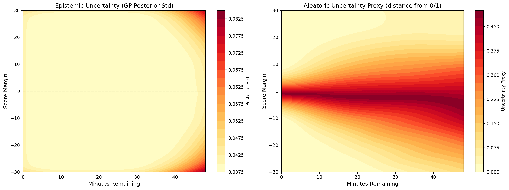

# Beyond Point Estimates: Bayesian Gaussian Process Inference for In-Game NBA Win Probability with Uncertainty Quantification

Lacuata, Lord Joshua E.  |  AI 221 Machine Learning  |  University of the Philippines Diliman

Every widely deployed NBA win probability model reports a single number. When a broadcast graphic states that the home team has a 73% chance of winning, it communicates nothing about how confident that estimate is. A 73% derived from a game state observed thousands of times and a 73% extrapolated to a rarely seen scenario are treated identically, even though they carry very different informational content.

This study applies Bayesian inference through Gaussian Process regression to estimate the full posterior predictive distribution of win probability conditioned on game state. The model returns both a probability and a calibrated credible interval at every moment of a game, and the resulting uncertainty is decomposed into an epistemic component, which reflects how much the model has seen of a given state, and an aleatoric component, which reflects how genuinely undecided the outcome is.

---

## 1. Data

Play-by-play data was collected for all NBA regular season games from 2018-19 through 2023-24 via the `nba_api` Python package (PlayByPlayV3 endpoint). Game state was sampled at 2-minute intervals throughout regulation, producing 24 observations per game.

| Item | Value |
|------|-------|
| Total games | 6,962 |
| Total game-state observations | 174,050 |
| Training seasons | 2018-19 through 2022-23 (5 seasons, 5,732 games, 143,300 snapshots) |
| Test season | 2023-24 (1,230 games, 30,750 snapshots) |
| Train/test overlap | 0 |
| GP training bins | 634 (mean 226 observations per bin) |
| Input features | Score margin, time remaining |
| Target | Binary: did the home team win (1) or lose (0) |
| Exclusions | Orlando bubble games (2019-20), overtime periods, playoff games |

For GP training the observation-level data was aggregated into a two-dimensional grid, with score margin binned in 2-point increments and time remaining in 120-second increments. Bins holding fewer than 5 observations were discarded, and the empirical win rate within each surviving bin became the regression target.

---

## 2. Bayesian Model Selection

Five candidate kernels were compared via log marginal likelihood (LML), which balances data fit against model complexity and implements an automatic Occam's razor. The composite RBF + Matérn 1.5 kernel achieves the highest LML, indicating win probability is best represented as a mixture of smooth and moderately rough components.

| Kernel | Log Marginal Likelihood |
|--------|------------------------|
| **RBF + Matérn 1.5** | **589.68** |
| Matérn 1.5 | 587.23 |
| Matérn 2.5 | 587.15 |
| RBF | 577.90 |
| Rational Quadratic | 557.74 |

**Optimized composite kernel:**

```
k = 0.988² · RBF(ℓ = [0.72, 4.99]) + 0.262² · Matérn₁.₅(ℓ = [1.13, 2.94]) + White(σ² = 0.01)
```

**Interpretation:** After normalizing the squared mixing weights, win probability is approximately 93% smooth with 7% roughness. The smooth component describes the possession-by-possession drift that occupies most of a game. The rough component captures the sharp shifts that anyone who watches basketball would recognize: a quick 8-0 run off turnovers, a dagger three in transition, or an and-one that swings a 4-point margin in a single play. The GP arrived at this structure through marginal likelihood optimization alone, without any basketball knowledge encoded in the kernel design.

The RBF length scales indicate that score margin changes are significant over a shorter range than time remaining changes: a few-point scoring run alters win probability more sharply than an equivalent interval of game clock.

---

## 3. GP Posterior Surfaces


**Left:** The posterior mean surface shows smooth probability gradients with contours tightening as time runs out. **Right:** The posterior standard deviation is highest at extreme margins in early-game regions, where training data is sparse, and lowest in the dense central region.

---

## 4. Model Comparison (2023-24 Test Season)

| Model | Log-Loss | Brier Score | Accuracy |
|-------|----------|-------------|----------|
| Logistic Regression (simple) | 0.4998 | 0.1674 | 74.81% |
| Logistic Regression (poly deg 3) | 0.4804 | 0.1627 | 74.94% |
| XGBoost | **0.4766** | **0.1618** | **74.97%** |
| Gaussian Process (RBF + Matérn 1.5) | 0.4831 | 0.1636 | 74.79% |

XGBoost outperforms the GP by 0.0065 in log-loss. The gap is reproducible but small enough to be practically negligible, and it has a clear structural cause. XGBoost learns hard cutoffs, so when the margin crosses a threshold at a given time the prediction jumps. The GP cannot do that because the kernel forces the surface to be smooth and continuous everywhere, which means it slightly underpredicts certainty in late-game scenarios where a moderate lead is effectively a guaranteed win.

All four models land within the 74.8 to 75.0% accuracy range, reflecting a shared ceiling imposed by the two-feature input space. The GP is not intended to win on accuracy. It is intended to match the baselines while returning something none of them can produce.

---

## 5. Bayesian Evaluation

| Metric | Value |
|--------|-------|
| 90% Credible Interval Coverage | 80.00% (16/20 bins) |
| 95% Credible Interval Coverage | 80.00% (16/20 bins) |
| Posterior Sharpness (avg 90% width) | 0.1331 |
| Posterior Sharpness (median 90% width) | 0.1250 |

Coverage plateaus at 80% across both nominal levels because the posterior standard deviation is tightly concentrated: 99% of test observations fall between 0.038 and 0.083, and the mean standard deviation within each of the 20 evaluation bins spans only 0.038 to 0.047. Widening the nominal level therefore adds little discriminative power. Sub-nominal coverage reflects the GP's capture of epistemic uncertainty about the win probability function without modeling the aleatoric component of binary outcome variance.

---

## 6. Epistemic vs. Aleatoric Decomposition

This is the central analytical finding of the study.

| Context | Epistemic (GP Std) | Aleatoric Proxy | n |
|---------|-------------------|-----------------|---|
| Blowout (\|m\| ≥ 15) | 0.0480 | 0.0527 | 6,231 |
| Clutch (\|m\| ≤ 5, t < 5 min) | 0.0393 | 0.3142 | 988 |
| Normal | 0.0385 | 0.3145 | 23,531 |

**Blowout states:** elevated epistemic uncertainty from sparse data, very low aleatoric uncertainty because the leading team almost always wins.
**Clutch states:** low epistemic uncertainty from abundant data near margin zero, high aleatoric uncertainty because the outcome is close to a coin flip.

Clutch and normal contexts show comparably high aleatoric uncertainty, 0.3142 and 0.3145 respectively, both approximately 6x higher than blowout states. The aleatoric dimension therefore separates decided games from undecided ones rather than clutch time from the rest of the game.



**Left:** Epistemic uncertainty is highest at extreme margins. **Right:** Aleatoric uncertainty is highest near margin zero. The two surfaces carry structurally different information, and a point estimate collapses both into a single number.

---

## 7. Design Decisions

| Decision | Why |
|----------|-----|
| GP regression on binned data instead of GP classification | A full GP on 143,300 binary observations would take weeks on a laptop. Binning to 634 points keeps the Bayesian math intact and runs in seconds. |
| Only two input features (score margin, time remaining) | I wanted to test the uncertainty idea cleanly without muddying the results with dozens of engineered features. These two are enough for competitive win probability per Lock and Nettleton (2014). |
| Five training seasons, one test season | More seasons means denser bins and more reliable win rates. Holding out the latest season keeps the test completely unseen. |
| Temporal split, no random shuffle | The model should never see future games during training. That is how it would work in real life, so that is how I evaluated it. |
| Composite RBF + Matérn 1.5 kernel | I let the data pick the kernel through marginal likelihood instead of choosing by hand. The blend of smooth and rough makes basketball sense since a quick scoring run can shift win probability sharply. |
| Bounded WhiteKernel noise floor at 0.01 | Without the bound the GP got overconfident. The floor forces it to admit that team quality, injuries, and rest create noise that two features cannot capture. |
| XGBoost as a third baseline | I needed a strong comparison. Matching XGBoost within 0.007 log-loss while also providing uncertainty bands is a more convincing result than beating only logistic regression. |
| Bubble games excluded | No fans, neutral court, home advantage gone. Including those games would teach the model the wrong thing about score margin. |
| Overtime excluded | Rare, creates messy edge cases in the time feature, not worth the added complexity. |
| Marginal likelihood instead of cross-validation for kernel selection | It is the Bayesian way. Automatically penalizes overly flexible kernels and ties directly to Week 6 course material. |
| Aleatoric proxy (distance from 0.5) instead of formal decomposition | A proper decomposition needs methods beyond the course scope. The proxy is simple but captures the key insight: predictions near 50-50 mean the game itself is a coin flip. |
| Rolling validation across two test splits | One test season could be a fluke. Two splits with differences below 0.002 confirms the results are stable, not luck. |
| 2-minute sampling interval | Fine enough to catch scoring runs, coarse enough to keep the dataset manageable. |

---

## 8. Repository Structure

```
nba-gp-win-probability/
├── notebooks/
│   ├── 01_data_collection.ipynb   NBA API pulls (play-by-play and game logs)
│   └── nba_gp_complete.ipynb      Full pipeline: EDA, baselines, GP, figures
├── figures/                       All generated figures
├── paper/                         IEEE-format paper (LaTeX source and PDF)
├── demo/live_prediction.py        Console demo: game state in, posterior out
├── make_ga_assets.py              Rebuilds the standalone graphical abstract assets
└── data/                          Not tracked; regenerated by the notebooks
```

Neither the raw data nor the trained artifacts are tracked in version control, as the play-by-play files run to several hundred megabytes.

---

## 9. Reproducing the Results

```bash
git clone https://github.com/lsjao/nba-gp-win-probability.git
cd nba-gp-win-probability
pip install -r requirements.txt
```

Run `notebooks/01_data_collection.ipynb` first to pull the play-by-play data into `data/raw/`. The full six-season pull takes a while and is rate-limited by the NBA API. Then run `notebooks/nba_gp_complete.ipynb` end to end, which writes the processed datasets, the trained model, and every figure in `figures/`.

---

## 10. Live Prediction Demo

Once `nba_gp_complete.ipynb` has written `data/processed/best_gp_model.pkl`:

```bash
python demo/live_prediction.py
```

The script prompts for a game state and returns the posterior mean, both uncertainty components, credible intervals, and a context classification. Overtime, tied games, and out-of-range clock values are handled explicitly.

```
  Home team: BOS
  Away team: MIA
  Home score: 105
  Away score: 103
  Quarter (1-4, or 5+ for OT): 4
  Time left in period (M:SS, max 12:00): 1:30

==========================================================
  BOS 105 - 103 MIA
  Q4 1:30  |  BOS +2
==========================================================
  P(BOS win):          71.3%
  P(MIA win):          28.7%

  Epistemic (GP std):   0.0394
  Aleatoric proxy:      0.2874

  90% credible interval: [64.8%, 77.7%]
  95% credible interval: [63.5%, 79.0%]

  Context: CLUTCH
==========================================================
```

---

## 11. Limitations

The two-dimensional input space omits team quality, player availability, foul trouble, and possession state. Adding those features is not free, since exact GP inference costs O(n³) in the number of training points and a richer feature space would require sparse or inducing-point approximations.

The GP is fitted to binned win rates rather than to individual binary outcomes, which is an approximation of full GP classification. Binning discards within-bin variation and treats each bin's empirical rate as a noisy observation of a latent smooth function.

Credible interval coverage sits at 80% for both the 90% and 95% nominal levels, because the posterior quantifies uncertainty about the win probability function rather than the variance of the binary outcome around that function.

No comparison against a proprietary model was possible, as ESPN, NBA.com, and the betting markets do not archive their predictions in a form that can be downloaded and scored after the fact.

The rolling temporal validation was run with a Matérn 1.5 kernel alone rather than the composite kernel that was ultimately deployed. The two kernels differ by 2.45 in log marginal likelihood and produce very similar surfaces, so the stability conclusion is unlikely to change, but the validated and deployed architectures are not strictly identical.

---

## Paper

`paper/nba_gp_report.pdf`, in IEEE conference format. LaTeX source is in the same directory.

## Citation

```
Lacuata, L.J.E. (2026). Beyond Point Estimates: Bayesian Gaussian Process
Inference for In-Game NBA Win Probability with Uncertainty Quantification.
AI 221 Machine Learning, University of the Philippines Diliman.
```

## License

MIT. See [LICENSE](LICENSE).
