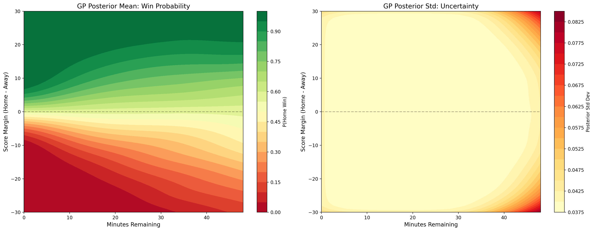

# Beyond Point Estimates: Bayesian GP Inference for In-Game NBA Win Probability with Uncertainty Quantification

**Lacuata, Lord Joshua E.** | AI 221 Machine Learning | University of the Philippines Diliman | 2026

---

## What This Is

Every win probability model you see on an NBA broadcast gives you one number. When ESPN says the Celtics have a 73% chance of winning, it never tells you how much it trusts that 73%. This project adds that missing layer.

Using Bayesian Gaussian Process regression, the model takes two inputs, the current score margin and the time remaining, and returns a win probability alongside a calibrated credible interval that quantifies how confident the prediction is. The uncertainty naturally decomposes into two components: epistemic uncertainty (the model lacks data for this game state) and aleatoric uncertainty (the game itself is genuinely unpredictable). That decomposition reveals something no point-estimate model can show you.



---

## Key Findings

The GP matches XGBoost within 0.007 log-loss on the held-out 2023-24 season while providing native posterior uncertainty that none of the frequentist baselines can produce.

| Model | Log-Loss | Brier | Accuracy |
|-------|----------|-------|----------|
| LR (simple) | 0.4998 | 0.1674 | 74.81% |
| LR (poly deg 3) | 0.4804 | 0.1627 | 74.94% |
| XGBoost | **0.4766** | **0.1618** | **74.97%** |
| GP (RBF + Matérn 1.5) | 0.4831 | 0.1636 | 74.79% |

Bayesian model selection via log marginal likelihood identified a composite RBF + Matérn 1.5 kernel as the best prior. The optimized weights reveal that NBA win probability is roughly 93% smooth and 7% rough, a structural finding about how basketball games unfold that the GP discovered on its own without any basketball knowledge encoded in the kernel design.

The epistemic-aleatoric decomposition is the central finding. Blowout game states carry high epistemic uncertainty (the model has seen few games like this) but low aleatoric uncertainty (the outcome is near-certain). Clutch game states carry the inverse: low epistemic, high aleatoric. The contrast in the aleatoric dimension is approximately 7x, and it is completely invisible to every point-estimate model deployed today.

| Context | Epistemic (GP Std) | Aleatoric Proxy | n |
|---------|-------------------|-----------------|---|
| Blowout (\|m\| ≥ 15) | 0.048 | 0.053 | 6,231 |
| Clutch (\|m\| ≤ 5, t < 5 min) | 0.039 | 0.314 | 988 |
| Normal | 0.039 | 0.315 | 23,531 |

---

## The Data

Play-by-play data was pulled from the NBA's official API via `nba_api` (PlayByPlayV3 endpoint) for all regular season games from 2018-19 through 2023-24. Game state was sampled every 2 minutes throughout regulation.

| Category              | Value/Details                                                                 |
|-----------------------|-------------------------------------------------------------------------------|
| Games                 | 6,962                                                                         |
| Game‑state observations | 174,050                                                                      |
| Training set          | 2018–19 through 2022–23 (5 seasons, 5,732 games)                              |
| Test set              | 2023–24 (1,230 games, held out entirely)                                      |
| GP training bins      | 634 (mean 226 observations per bin)                                           |
| Exclusions            | Bubble games, overtime, playoffs                                              |


---

## Live Prediction

Once you have run the pipeline and the trained model exists on disk:

```bash
python demo/live_prediction.py
```

```
  Home team: BOS
  Away team: MIA
  Home score: 105
  Away score: 103
  Quarter (1-4): 4
  Time left in period (M:SS): 1:30

==========================================================
  BOS 105 - 103 MIA
  Q4 1:30  |  BOS +2
==========================================================
  P(BOS win):          71.3%
  P(MIA win):          28.7%

  Epistemic (GP std):   0.0394
  Aleatoric proxy:      0.2874

  90% credible interval: [64.8%, 77.7%]
  95% credible interval: [63.5%, 79.0%]

  Context: CLUTCH
==========================================================
```

---

## Repo Structure

```
nba-gp-win-probability/
├── notebooks/
│   ├── 01_data_collection.ipynb      NBA API pulls
│   └── nba_gp_complete.ipynb         Full pipeline: EDA → baselines → GP → figures
├── figures/                          All generated plots
├── paper/                            LaTeX source and compiled PDF (IEEE format)
├── demo/
│   └── live_prediction.py            Console demo
├── requirements.txt
└── data/                             Not tracked, regenerated by notebooks
```

---

## Reproducing Everything

```bash
git clone https://github.com/lsjao/nba-gp-win-probability.git
cd nba-gp-win-probability
pip install -r requirements.txt
```

Run `notebooks/01_data_collection.ipynb` first. The full six-season play-by-play pull takes a while because the NBA API rate-limits requests to about one per second. Then run `notebooks/nba_gp_complete.ipynb` top to bottom. It writes all processed data, trains all models, and generates every figure.

---

## Design Decisions

| Decision | Why |
|----------|-----|
| GP regression on binned data instead of GP classification | Full GP on 143,300 binary observations would take weeks on a laptop. Binning to 634 points keeps the Bayesian math intact and runs in seconds. |
| Two input features only | Isolates the uncertainty contribution cleanly. These two features are sufficient for competitive win probability per Lock and Nettleton (2014). |
| Five training seasons, one test season | Denser bins, more reliable win rates. Latest season held out entirely. |
| Temporal split, no random shuffle | The model should never see future games during training. |
| Composite kernel selected by marginal likelihood | Let the data pick the kernel instead of choosing by hand. |
| Bounded WhiteKernel noise floor | Without it the GP got overconfident. The floor forces honesty about unmodeled variance. |
| XGBoost as a baseline | Needed a strong opponent. Matching it within 0.007 log-loss while providing uncertainty is more convincing than beating only logistic regression. |
| Bubble and overtime exclusions | Bubble games had no home advantage. Overtime creates edge cases in the time feature. Neither is worth the noise. |
| Aleatoric proxy instead of formal decomposition | A proper decomposition needs heteroscedastic GPs, beyond course scope. The proxy captures the core insight. |

---

## Limitations

The model sees the scoreboard without the context of the actual basketball game. A 2-point lead after leading all game and a 2-point lead after a 19-point comeback produce the same prediction and the same uncertainty band, because the GP operates on a Markov assumption with no trajectory features. Incorporating margin velocity and recent scoring runs is the next step.

The binning approach is an approximation of full GP classification. It discards within-bin variation and treats each bin's empirical win rate as a noisy observation of a latent function.

Credible interval coverage sits at 80% for both the 90% and 95% nominal levels, because the posterior variance is concentrated in a narrow range and widening the z-score adds little discriminative power.

No comparison against ESPN or other proprietary models was possible. They do not archive their predictions in a downloadable form.

---

## Citation

```
Lacuata, L.J.E. (2026). Beyond Point Estimates: Bayesian Gaussian Process
Inference for In-Game NBA Win Probability with Uncertainty Quantification.
AI 221 Machine Learning, University of the Philippines Diliman.
```

---

## License

MIT
